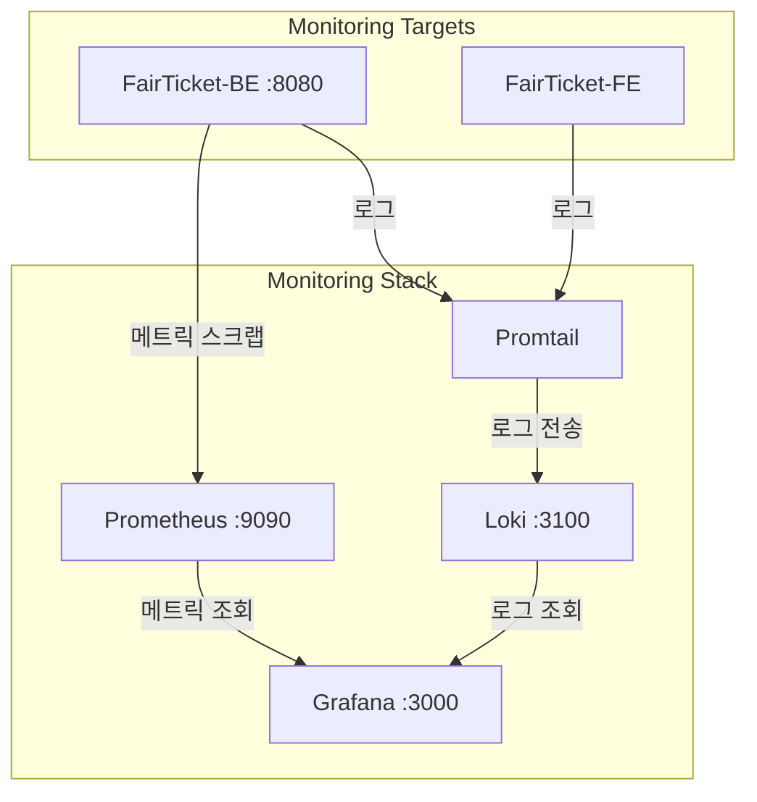

# FairTicket Monitoring

## Architecture

모니터링 스택은 Prometheus(메트릭 수집 및 저장소), Loki(로그 저장소), Promtail(로그 수집), Grafana(시각화)로 구성되며, FairTicket-BE와 FairTicket-FE를 대상으로 합니다.



## How to Start

### 1. 스택 실행

`FairTicket-Monitoring` 디렉토리에서:

```bash
docker compose up -d
docker compose down -v
```

### 2. 각 툴 접속

| 툴 | URL | 비고 |
|----|-----|------|
| **Grafana** | http://localhost:3000 | 로그인: `admin` / `admin` |
| **Prometheus** | http://localhost:9090 | 메트릭 조회 및 PromQL |
| **Loki** | http://localhost:3100 | 로그 저장소 |

### 3. Grafana 대시보드 추가

1. http://localhost:3000 에서 Grafana에 로그인합니다.
2. 왼쪽 메뉴 **Dashboards** → **New** → **Import** 를 선택합니다.
3. 대시보드 ID **17175** 를 입력하고 **Load**를 누릅니다.
4. Prometheus·Loki 데이터소스를 각각 선택한 뒤 **Import** 로 대시보드를 불러옵니다.
