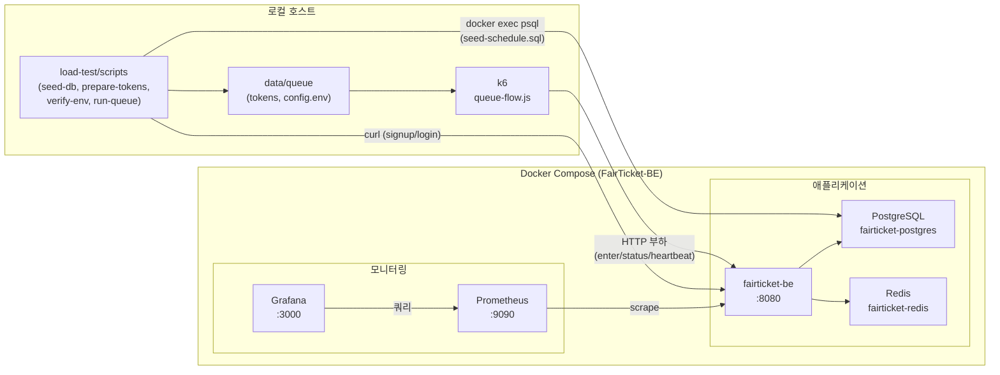
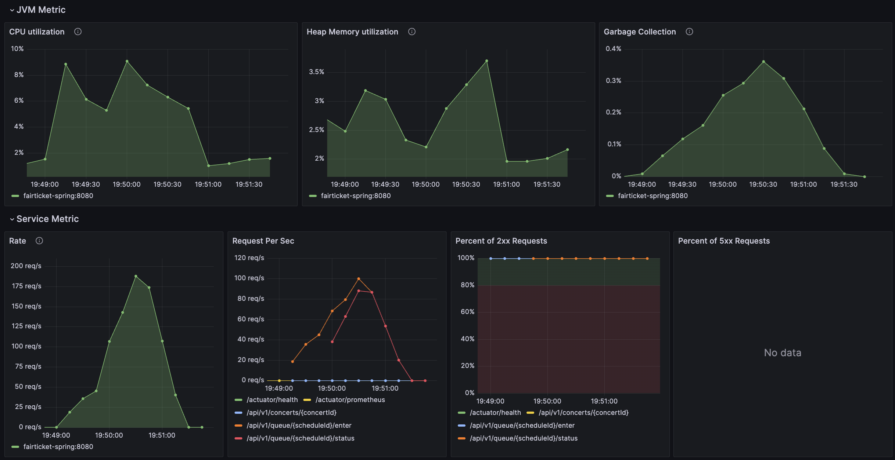
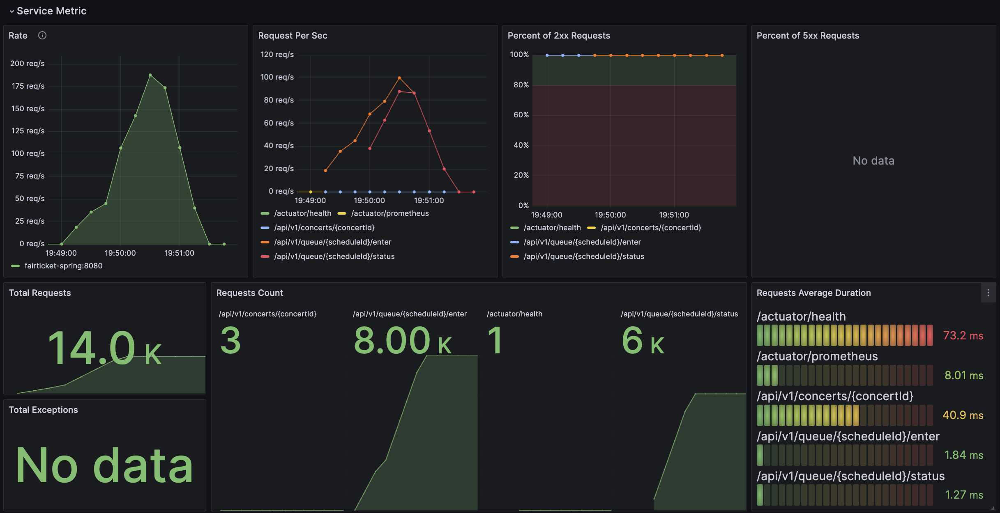
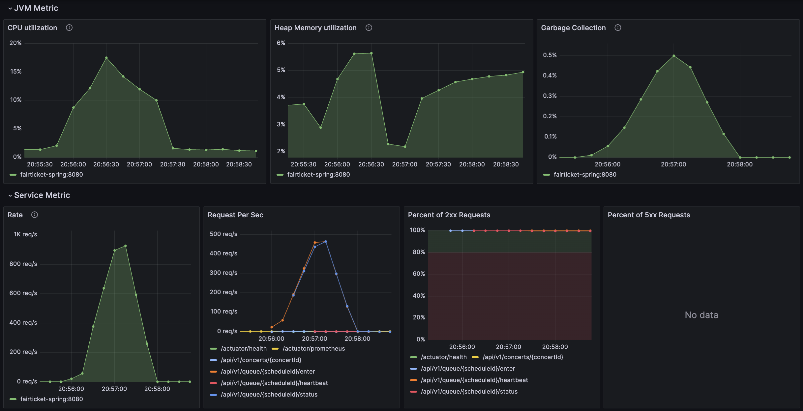
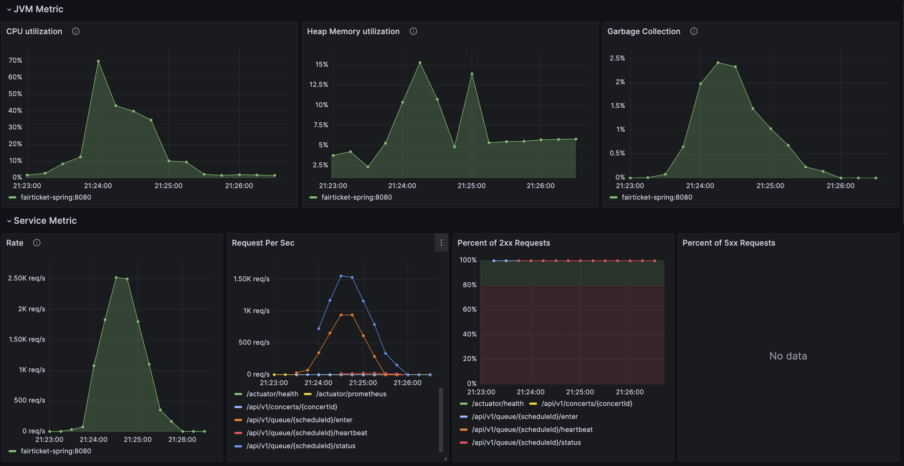
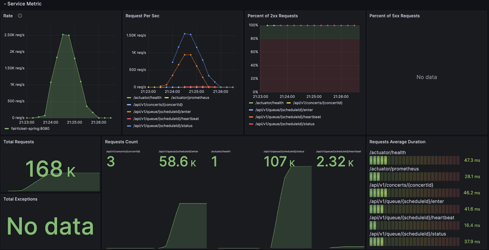

# FairTicket-BE 부하 테스트 (k6)

k6 기반 부하 테스트 데이터, 시나리오, 스크립트 모음입니다. **대기열(Queue) 폭주** 시나리오를 다룹니다.

## 목차

- [01. 개요 및 목적](#01-개요-및-목적)
- [02. 아키텍처](#02-아키텍처)
- [03. 테스트 툴 선정](#03-테스트-툴-선정)
- [04. 빠른 시작 및 디렉토리 구조](#04-빠른-시작-및-디렉토리-구조)
- [05. 요구 사항 및 주의점](#05-요구-사항-및-주의점)
- [06. 부하 시나리오](#06-부하-시나리오)
- [07. TPS별 부하 진행](#07-tps별-부하-진행)
  - [07-1. 100TPS인 경우](#07-1-100tps인-경우)
  - [07-2. 500TPS인 경우](#07-2-500tps인-경우)
  - [07-3. 1000TPS인 경우](#07-3-1000tps인-경우)
- [08. 결론 및 튜닝포인트](#08-결론-및-튜닝포인트)

## 01. 개요 및 목적

이 문서는 FairTicket-BE의 대기열(Queue) 시스템에 대한 부하 테스트 가이드입니다. k6를 사용하여 오픈 직후 동시 접속이 몰릴 때 대기열이 견디는지 확인합니다.

**주요 목적**:
- 대기열 시스템의 성능 한계 파악
- Redis Sorted Set/토큰 발급 지연 측정
- Rate Limit(429) 발생 구간 확인
- 타임아웃/에러율 모니터링
- Spring JVM 메트릭(CPU, Heap Memory, Garbage Collection) 모니터링
- TPS별 성능 특성 분석

## 02. 아키텍처

부하 테스트는 **Docker Compose로 띄운 FairTicket-BE 스택**에 대해, **로컬 호스트에서 k6/스크립트**로 요청을 보내는 구조입니다. 메트릭은 **Prometheus / Grafana**로 수집·조회합니다.



- **호스트**: `load-test/` 스크립트로 토큰 생성·DB 시드·환경 검증 후, **k6**가 대기열 API에 부하를 걸습니다.
- **애플리케이션**: API 서버(fairticket-be), PostgreSQL, Redis. BE가 DB/Redis와 통신합니다.
- **모니터링**: **Prometheus**가 BE의 `/actuator/prometheus` 메트릭을 수집합니다. **Grafana**(localhost:3000)에서 메트릭 대시보드를 조회할 수 있습니다.
- **접속**: k6·curl은 `BASE_URL`(기본 `http://localhost:8080`)로 요청하며, seed-db는 `docker exec`로 컨테이너 내부 Postgres에 SQL을 적용합니다.

## 03. 테스트 툴 선정

이 프로젝트는 초기에 **wrk** 기반으로 시작되었으나, **k6**로 전환되었습니다. 전환 이유와 과정은 다음과 같습니다.

### 전환 이유

#### wrk의 문제점

1. **응답 본문 처리 불안정**
   - wrk는 성능 최적화로 `init()` 호출 후 `response` 함수가 정의되지 않으면 body를 파싱하지 않습니다.
   - `response` 함수가 정의되어 있어도 wrk 버전/설정에 따라 호출되지 않을 수 있습니다.
   - `body`가 `nil`이거나 빈 값일 수 있어 READY 상태 감지가 불안정합니다.

2. **스레드별 변수 동기화 문제**
   - wrk는 멀티스레드 기반으로 동작하며, 스레드별로 독립적인 Lua 상태를 사용합니다.
   - 전역 변수 동기화가 어려워 정확한 메트릭 집계가 어렵습니다.

3. **디버깅 및 유지보수 어려움**
   - Lua 스크립트는 디버깅이 어렵고, 로깅 기능이 제한적입니다.
   - 복잡한 로직 구현이 어렵고 코드 가독성이 떨어집니다.

#### k6의 장점

1. **응답 본문 처리 안정성**
   - JavaScript 기반으로 응답 본문 파싱과 검증이 안정적입니다.
   - `JSON.parse()`를 사용하여 정확한 READY 상태 감지가 가능합니다.

2. **강력한 메트릭 수집**
   - 커스텀 메트릭(`Counter`, `Trend`, `Gauge`)을 쉽게 정의할 수 있습니다.
   - 체크(`check`)와 임계값(`thresholds`) 설정으로 자동 검증이 가능합니다.
   - 상세한 메트릭을 기본 제공합니다 (p50, p95, p99 등).

3. **디버깅 및 유지보수 용이**
   - JavaScript로 작성되어 개발자에게 친숙합니다.
   - `console.log()`로 쉬운 로깅이 가능합니다.
   - 코드 가독성과 유지보수성이 뛰어납니다.

4. **확장성**
   - Cloud 실행 지원 (k6 Cloud)
   - 고급 시나리오 지원 (scenarios, executors)
   - 향후 확장에 유리합니다.

### 전환 과정

#### 1. 스크립트 변환

**Lua → JavaScript 변환**:
- `queue-flow.lua` → `queue-flow.js`
- `queue-enter.lua` → `queue-enter.js`
- `queue-status.lua` → `queue-status.js`
- `queue-heartbeat.lua` → `queue-heartbeat.js`

**주요 변경사항**:
- wrk의 `wrk.format()` → k6의 `http.get()`, `http.post()`
- wrk의 `response()` 함수 → k6의 `check()` 함수와 응답 본문 직접 파싱
- wrk의 `delay()` 함수 → k6의 `sleep()` 함수
- wrk의 스레드/연결 개념 → k6의 Virtual Users (VUs) 개념

#### 2. 설정 변경

**환경 변수 변경**:
- `WRK_THREADS`, `WRK_CONNECTIONS`, `WRK_DURATION` 제거
- `K6_VUS`, `K6_DURATION` 추가

**토큰 파일 형식 변경**:
- Lua 형식(`tokens_generated.lua`) 제거
- JSON 형식(`tokens.json`) 추가 (k6의 `open()` 함수 사용)

#### 3. 실행 스크립트 업데이트

**Bash 스크립트 변경**:
- `04-run-queue-{100|500|1000|2000}.sh`: wrk 명령어를 k6 명령어로 변경
- 환경 변수 전달 방식 변경 (`--env` 플래그 사용)

**토큰 준비 스크립트 업데이트**:
- `02-prepare-tokens.sh`: JSON 형식 토큰 파일 생성 추가

#### 4. 문서 업데이트

- README.md: wrk 언급을 모두 k6로 변경
- 디렉토리 구조에서 `.lua` 파일 제거
- k6 명령어 예시로 업데이트

### 전환 결과

- ✅ 응답 본문 처리 안정성 향상
- ✅ READY 상태 감지 정확도 개선
- ✅ 커스텀 메트릭으로 상세한 분석 가능
- ✅ 코드 가독성 및 유지보수성 향상
- ✅ 향후 확장성 확보

## 04. 빠른 시작 및 디렉토리 구조

### 빠른 시작

```bash
cd load-test

# 1) 설정 로드 (선택사항, 스크립트 내부에서 자동 로드됨)
source data/config.env

# 2) DB 시드 — 스케줄을 "이미 오픈" 상태로 (2xx 응답을 위해)
# Docker 또는 로컬 psql을 자동으로 감지하여 적용
./scripts/01-seed-db.sh

# 3) 테스트 유저 및 JWT 토큰 생성
# 기존 토큰의 유효성을 검증하고, 유효한 토큰은 유지하며 부족한 개수만 새로 발급
# tokens.txt와 tokens.json(k6용)을 생성
./scripts/02-prepare-tokens.sh

# 4) 대기열 시나리오 실행 (자동으로 환경 검증 포함)
# 각 스크립트는 다음을 자동으로 수행합니다:
# - 스케줄 오픈 상태 확인 (미오픈 시 01-seed-db.sh 자동 실행)
# - 토큰 확인 및 필요시 발급 (유효한 토큰은 유지하고 부족한 개수만 발급)
# - 환경 검증 (03-verify-env.sh: 서버 연결, 스케줄 오픈, 토큰 유효성)
# - k6 실행 (queue-flow.js)
# TPS별 스크립트 선택:
./scripts/04-run-queue-100.sh  # TPS 100 (기본)
./scripts/04-run-queue-500.sh  # TPS 500
./scripts/04-run-queue-1000.sh  # TPS 1000
./scripts/04-run-queue-2000.sh  # TPS 2000
```

**참고**: `04-run-queue-*.sh` 스크립트는 `02-prepare-tokens.sh`를 호출하여 기존 토큰의 유효성을 검증하고, 유효한 토큰은 유지하며 부족한 개수만 새로 발급합니다. 따라서 토큰 만료 걱정 없이 반복 실행할 수 있습니다.

### 디렉토리 구조

```
load-test/
├── README.md                 # 이 파일
├── data/
│   ├── config.env           # 공통 설정 (BASE_URL, SCHEDULE_ID 등)
│   ├── tokens.txt.example   # tokens.txt 형식 예시
│   ├── seed-schedule.sql    # DB 시드 (스케줄 오픈)
│   └── queue/               # 대기열 시나리오
│       ├── tokens.txt       # prepare-tokens.sh 로 생성
│       └── tokens.json      # k6용 JSON 형식 토큰 파일
├── scripts/
│   ├── 01-seed-db.sh        # DB 시드 적용 (Docker 또는 로컬 psql 지원)
│   ├── 02-prepare-tokens.sh # N명 signup+login → tokens.txt → tokens.json (토큰 유효성 검증 포함)
│   ├── 03-verify-env.sh     # 스케줄 오픈·토큰 1건 curl로 200 여부 검증 (3단계 검증)
│   ├── 04-run-queue-100.sh  # 대기열 시나리오 실행 (TPS 100)
│   ├── 04-run-queue-500.sh  # 대기열 시나리오 실행 (TPS 500)
│   ├── 04-run-queue-1000.sh  # 대기열 시나리오 실행 (TPS 1000)
│   ├── 04-run-queue-2000.sh  # 대기열 시나리오 실행 (TPS 2000)
│   ├── queue-flow.js         # 통합 흐름 (enter → heartbeat + status 반복 until READY)
│   └── queue-enter.js, queue-status.js, queue-heartbeat.js  # 개별 API 부하 테스트
└── results/                  # 테스트 결과 로그
    ├── 100-tps-log.txt
    ├── 500-tps-log.txt
    └── 1000-tps-log.txt
```

### 스크립트 상세 설명

#### 01-seed-db.sh (DB 시드 적용)

스케줄을 "이미 오픈" 상태로 변경하여 부하 테스트에서 2xx 응답을 받을 수 있도록 합니다.

**지원 환경**:
- **Docker**: `fairticket-postgres` 컨테이너가 실행 중이면 `docker exec`로 SQL을 적용합니다.
- **로컬 psql**: Docker가 없으면 로컬 `psql`을 사용합니다 (기본: `localhost:5433`, 사용자: `fairticket`, 비밀번호: `fairticket123`).

**사용법**:
```bash
./scripts/01-seed-db.sh
```

#### 02-prepare-tokens.sh (토큰 생성)

**주요 기능**:
- **토큰 유효성 검증**: 기존 토큰 파일이 있으면 각 토큰의 유효성을 검증합니다 (401이 아니면 유효). 유효한 토큰은 유지하고 부족한 개수만 새로 발급합니다.
- **자동 번호 관리**: 기존 토큰 파일의 라인 수를 기반으로 시작 번호를 결정하여 중복을 방지합니다.
- **JSON 변환**: k6에서 사용할 수 있도록 `tokens.txt`를 `tokens.json` 형식으로 변환합니다.
- **옵션 지원**: `--skip-gen` 옵션으로 토큰 생성 없이 JSON 변환만 수행할 수 있습니다.

**사용법**:
```bash
./scripts/02-prepare-tokens.sh          # 토큰 생성 + JSON 변환
./scripts/02-prepare-tokens.sh --skip-gen  # JSON 변환만 수행
```

#### 03-verify-env.sh (환경 검증)

부하 테스트 실행 전 환경을 검증합니다. 3단계 검증을 수행합니다:

1. **서버 연결 확인**: `BASE_URL/actuator/health`로 서버 연결 여부 확인
2. **스케줄 오픈 여부 확인**: `GET /api/v1/concerts/{CONCERT_ID}`의 `dates[].available`로 해당 스케줄이 오픈 상태인지 확인
3. **토큰 유효성 확인**: `tokens.txt`의 첫 번째 토큰으로 `POST /api/v1/queue/{SCHEDULE_ID}/enter`를 실제 호출하여 HTTP 상태 코드 확인

**에러 처리**:
- 401: 토큰 만료 또는 JWT secret 불일치 → `02-prepare-tokens.sh` 재실행 필요
- 429: Rate Limit → 서버 설정 확인 또는 잠시 후 재시도
- 기타 4xx/5xx: 스케줄/콘서트 ID 또는 서버 로직 확인 필요

#### 04-run-queue-*.sh (TPS별 실행 스크립트)

**자동화 기능**:
- **스케줄 오픈 상태 확인**: `check_schedule_open()` 함수로 스케줄이 오픈 상태인지 확인합니다. 미오픈 시 `01-seed-db.sh`를 자동 실행합니다.
- **토큰 확인 및 필요시 발급**: `02-prepare-tokens.sh`를 호출하여 기존 토큰의 유효성을 검증하고, 유효한 토큰은 유지하며 부족한 개수만 새로 발급합니다 (`NUM_USERS=$K6_VUS_*`).
- **환경 검증**: `03-verify-env.sh`를 자동 실행하여 서버 연결, 스케줄 오픈, 토큰 유효성을 확인합니다.
- **절대 경로 전달**: `TOKEN_JSON_PATH`를 절대 경로로 전달하여 k6의 `open()` 함수에서 정확히 로드되도록 합니다.

## 05. 요구 사항 및 주의점

### 요구 사항

- [k6](https://k6.io/docs/getting-started/installation/) 설치
- FairTicket-BE 서버 실행 중 (기본 `http://localhost:8080`)
- (선택) `data/config.env` 에서 `BASE_URL`, `SCHEDULE_ID` 등 설정

### 로컬 테스트 시 Rate Limit

로컬 테스트 환경에서는 **Rate Limit이 비활성화**되어 있습니다 (`RATE_LIMIT_ENABLED = false`).  
따라서 모든 TPS 시나리오(100, 500, 1000, 2000)가 단일 IP에서도 429 에러 없이 동작하도록 설계되어 있습니다.

- **파일**: `src/main/java/com/fairticket/global/security/RateLimitFilter.java`
- **설정**: `RATE_LIMIT_ENABLED = false` → Rate Limit 미적용(무제한)

운영/스테이징 환경에서는 보안을 위해 `RATE_LIMIT_ENABLED = true`로 설정하고 `MAX_REQUESTS_PER_MINUTE`를 적절히 조정하세요.

### 토큰·스케줄 검증 (2xx가 0개일 때)

부하 테스트에서 **모든 응답이 Non-2xx**이면 다음을 확인하세요.

| 원인 | 확인 방법 | 조치 |
|------|-----------|------|
| **토큰 만료(401)** | `./scripts/03-verify-env.sh` 실행 | 토큰은 서버 `jwt.expiration`(기본 1시간)만 유효합니다. **테스트할 서버(BASE_URL)가 떠 있는 상태에서** `./scripts/02-prepare-tokens.sh` 다시 실행. |
| **JWT secret 불일치** | 서버 재기동 후 토큰 미재발급 | 같은 서버에서 02-prepare-tokens.sh로 발급한 토큰만 유효. 이미지/설정 변경 후 재기동했다면 토큰 다시 생성. |
| **스케줄 미오픈** | 03-verify-env.sh 2단계 실패 | `./scripts/01-seed-db.sh` 실행 후 재확인. |
| **Rate Limit(429)** | 03-verify-env.sh 3단계에서 429 | 로컬 테스트 환경에서는 발생하지 않아야 함. 운영 환경에서 발생 시 서버 `RATE_LIMIT_ENABLED` 또는 `MAX_REQUESTS_PER_MINUTE` 확인. |

실제 **HTTP 상태 코드**는 k6 결과의 **HTTP status breakdown**에 표시됩니다.

## 06. 부하 시나리오

### 목적

오픈 직후 동시 접속이 몰릴 때 대기열이 견디는지 확인한다.  
Redis Sorted Set/토큰 발급 지연, 429(Rate Limit) 발생 구간, 타임아웃/에러율, Spring JVM 메트릭(CPU, Heap Memory, Garbage Collection)을 본다.

### 시나리오 상세

**의미**: 오픈 직후 동시 접속이 몰릴 때 대기열이 견디는지 확인

**시나리오**:
- **동시 진입**: 한 스케줄에 N명(예: 1,000~5,000)이 동시에 `POST /api/v1/queue/{scheduleId}/enter`
- **상태 폴링**: 진입한 유저들이 주기적으로 `GET /api/v1/queue/{scheduleId}/status` 호출 (READY 시 리다이렉트까지 검증)
- **Heartbeat**: `POST /api/v1/queue/{scheduleId}/heartbeat` 동시/반복 호출

**확인 포인트**: Redis Sorted Set/토큰 발급 지연, 429(Rate Limit) 발생 구간, 타임아웃/에러율, Spring JVM 메트릭(CPU, Heap Memory, Garbage Collection)

### 테스트 시나리오

**한 사용자당 하나의 흐름**: enter 1회 → heartbeat + status 반복(WAITING 대기) → READY 수신.

| 구분 | 설명 | 스크립트 |
|------|------|----------|
| 통합 흐름 | enter 후 heartbeat + status 폴링 until READY (권장) | queue-flow.js |
| 개별 API 부하 | enter / status / heartbeat 각각 단독 부하 | queue-enter.js, queue-status.js, queue-heartbeat.js |

`04-run-queue-{100|500|1000|2000}.sh` 실행 시 다음을 자동으로 수행합니다:
1. **스케줄 오픈 상태 확인** (미오픈 시 01-seed-db.sh 자동 실행)
2. **토큰 확인 및 필요시 발급** (02-prepare-tokens.sh: 유효한 토큰은 유지하고 부족한 개수만 발급)
3. **환경 검증** (03-verify-env.sh: 서버 연결, 스케줄 오픈, 토큰 유효성 확인)
4. **통합 흐름(queue-flow.js)** 실행

각 가상 사용자(토큰)는 첫 요청에서 enter, 이후 요청에서 **하트비트(HEARTBEAT_INTERVAL_MS 간격)**와 **status(STATUS_POLL_MS 간격)**를 번갈아가며 보내며 WAITING → READY를 기다리는 구조입니다. 하트비트는 heartbeat TTL(30초)보다 짧은 간격(기본 20초)으로 전송하여 사용자가 큐에서 제거되지 않도록 합니다.

### 스크립트 구현 상세

#### queue-flow.js (통합 흐름)

**Executor 타입**: `constant-arrival-rate`  
정확한 TPS를 유지하기 위해 arrival rate executor를 사용합니다. 환경 변화와 관계없이 설정한 TPS를 일정하게 유지합니다.

**주요 기능**:
- **토큰 로드**: k6의 `open()` 함수로 JSON 형식 토큰 파일(`data/queue/tokens.json`)을 로드합니다. VU ID 기반으로 토큰을 순환 사용합니다.
- **하트비트 관리**: `HEARTBEAT_INTERVAL_MS`(기본 20초) 간격으로 하트비트를 전송하여 사용자가 큐에서 제거되지 않도록 합니다.
- **Status 폴링**: `STATUS_POLL_MS` 간격으로 status를 조회하며, READY 상태를 수신할 때까지 반복합니다.
- **무한 루프 방지**: 최대 반복 횟수(1000회) 제한을 두어 무한 대기를 방지합니다.

**커스텀 메트릭**:
- `enter_requests`: 대기열 진입 요청 수 (Counter)
- `status_requests`: 상태 조회 요청 수 (Counter)
- `heartbeat_requests`: 하트비트 전송 요청 수 (Counter)
- `ready_received`: READY 상태 수신 횟수 (Counter)
- `enter_duration`: Enter API 지연시간 (Trend)
- `status_duration`: Status API 지연시간 (Trend)
- `heartbeat_duration`: Heartbeat API 지연시간 (Trend)
- `ready_time`: Enter부터 READY까지 소요 시간 (Trend)
- **실패 분석용 메트릭**:
  - `enter_failures`: Enter 요청 실패 수 (Counter)
  - `status_failures`: Status 요청 실패 수 (Counter)
  - `heartbeat_failures`: Heartbeat 요청 실패 수 (Counter)
  - `status_404`: Status 404 (NOT_IN_QUEUE) 발생 수 (Counter)
  - `status_500`: 서버 에러(500) 발생 수 (Counter)
  - `timeout_errors`: 타임아웃/연결 실패 수 (Counter)

**환경 변수 처리**:
- `VUS`와 `DURATION` 환경 변수를 우선 사용합니다.
- `VUS`가 없으면 `K6_VUS`를, `DURATION`이 없으면 `K6_DURATION`을 사용합니다 (하위 호환성).
- `TARGET_TPS`가 유효하지 않으면 기본값 100을 사용합니다.
- `preAllocatedVUs`와 `maxVUs`는 자동 계산됩니다:
  - `preAllocatedVUs = Math.max(VUS || 100, targetRate)`
  - `maxVUs = Math.max((VUS || 100) * 2, targetRate * 2)`

**결과 요약 (handleSummary)**:
테스트 종료 시 다음 정보를 출력합니다:
- **요청 통계**: Enter/Status/Heartbeat 요청 수, READY 수신 횟수, 전체 요청 수, 실패율
- **실패 분석**: Enter/Status/Heartbeat 실패 수, Status 404/500 발생 수, 타임아웃/연결 실패 수, Status 404 비율
- **지연시간**: 전체 HTTP 요청, Enter API, Status API, Heartbeat API의 min/avg/max/p50/p90/p95/p99
- **Enter → READY 소요 시간**: min/avg/max/p50/p90/p95/p99
- **처리량**: 테스트 지속 시간, 전체 평균 RPS, Enter RPS, Status RPS, Heartbeat RPS, 실제 TPS, TPS 달성률

### TPS별 시나리오 설정

대기열 부하를 **초당 진입(enter) 수**에 따라 100, 500, 1000, 2000 TPS로 구분하여 테스트할 수 있습니다. 각 TPS별로 독립적인 설정 변수를 사용하므로 서로 영향을 주지 않습니다.

- **서버 Rate Limit**: 로컬 테스트 환경에서는 `RATE_LIMIT_ENABLED = false`로 설정되어 있어 Rate Limit이 적용되지 않습니다. 모든 시나리오가 단일 IP에서도 429 에러 없이 동작합니다.
- **TPS별 스크립트**: `04-run-queue-{100|500|1000|2000}.sh` 각각 해당 TPS 전용 변수를 사용합니다.

#### 100 TPS 시나리오 (기본 설계)

로컬 테스트 환경에서는 Rate Limit이 비활성화되어 있어 단일 IP에서도 429 없이 동작합니다.

- **목표 TPS**: 초당 대기열 진입(enter) 수. `TARGET_TPS_100=100`으로 **100 TPS** 고정.  
- **status 폴링 간격**: 진입한 사용자가 status를 호출하는 주기. `STATUS_POLL_MS_100=1000`(1초)으로 설정.  
- **하트비트 간격**: 진입한 사용자가 하트비트를 전송하는 주기. `HEARTBEAT_INTERVAL_MS=20000`(20초)으로 설정해, heartbeat TTL(30초)보다 짧게 유지하여 사용자가 큐에서 제거되지 않도록 함.
- 즉, "초당 100명 진입 + 이미 대기 중인 사용자들은 1초마다 status 폴링 + 20초마다 하트비트 전송" 구조.

| 목표 | 설정 |
|------|------|
| Enter TPS | `TARGET_TPS_100=100` → k6가 VU당 간격으로 초당 100건 enter 발생 |
| Status 폴링 | `STATUS_POLL_MS_100=1000` → 진입한 사용자당 1초마다 status 1회 |
| k6 | `K6_VUS_100=100` (config.env와 스크립트 기본값 동일), `K6_DURATION_100=60s` → 동시 유저 100명 시뮬레이션 |

**실행**: `./scripts/04-run-queue-100.sh`

#### 500 TPS 시나리오

최고 부하 테스트를 위한 설정입니다.

- **목표 TPS**: 초당 대기열 진입(enter) 수. `TARGET_TPS_500=500`으로 **500 TPS** 고정.  
- **status 폴링 간격**: `STATUS_POLL_MS_500=1000`(1초) 기본값. 필요 시 조정 가능.
- **하트비트 간격**: `HEARTBEAT_INTERVAL_MS=20000`(20초) 공통 설정 사용.

| 목표 | 설정 |
|------|------|
| Enter TPS | `TARGET_TPS_500=500` → k6가 VU당 간격으로 초당 500건 enter 발생 |
| Status 폴링 | `STATUS_POLL_MS_500=1000` → 진입한 사용자당 1초마다 status 1회 |
| k6 | `K6_VUS_500=500` (config.env와 스크립트 기본값 동일), `K6_DURATION_500=60s` → 동시 유저 500명 시뮬레이션 |

**실행**: `./scripts/04-run-queue-500.sh`

#### 1000 TPS 시나리오

고부하 테스트를 위한 설정입니다.

- **목표 TPS**: 초당 대기열 진입(enter) 수. `TARGET_TPS_1000=1000`으로 **1000 TPS** 고정.  
- **status 폴링 간격**: `STATUS_POLL_MS_1000=1000`(1초) 기본값. 필요 시 조정 가능.
- **하트비트 간격**: `HEARTBEAT_INTERVAL_MS=20000`(20초) 공통 설정 사용.

| 목표 | 설정 |
|------|------|
| Enter TPS | `TARGET_TPS_1000=1000` → k6가 VU당 간격으로 초당 1000건 enter 발생 |
| Status 폴링 | `STATUS_POLL_MS_1000=1000` → 진입한 사용자당 1초마다 status 1회 |
| k6 | `K6_VUS_1000=1000` (config.env와 스크립트 기본값 동일), `K6_DURATION_1000=60s` → 동시 유저 1000명 시뮬레이션 |

**실행**: `./scripts/04-run-queue-1000.sh`

#### 2000 TPS 시나리오

초고부하 테스트를 위한 설정입니다.

- **목표 TPS**: 초당 대기열 진입(enter) 수. `TARGET_TPS_2000=2000`으로 **2000 TPS** 고정.  
- **status 폴링 간격**: `STATUS_POLL_MS_2000=1000`(1초) 기본값. 필요 시 조정 가능.
- **하트비트 간격**: `HEARTBEAT_INTERVAL_MS=20000`(20초) 공통 설정 사용.

| 목표 | 설정 |
|------|------|
| Enter TPS | `TARGET_TPS_2000=2000` → k6가 VU당 간격으로 초당 2000건 enter 발생 |
| Status 폴링 | `STATUS_POLL_MS_2000=1000` → 진입한 사용자당 1초마다 status 1회 |
| k6 | `K6_VUS_2000=2000` (config.env 기본값) / `2000` (스크립트 기본값), `K6_DURATION_2000=60s` → 동시 유저 2000명 시뮬레이션 |

**실행**: `./scripts/04-run-queue-2000.sh`

### 환경 변수 (config.env / 실행 시)

각 TPS별로 독립적인 변수를 사용하므로 서로 영향을 주지 않습니다.

**참고**: `queue-flow.js`는 `VUS`와 `DURATION` 환경 변수를 우선 사용합니다. `04-run-queue-*.sh` 스크립트는 `K6_VUS_*`와 `K6_DURATION_*`를 `VUS`와 `DURATION`으로 매핑하여 전달합니다. `queue-flow.js`는 `VUS`가 없으면 `K6_VUS`를, `DURATION`이 없으면 `K6_DURATION`을 사용합니다 (하위 호환성). `TARGET_TPS`가 유효하지 않으면 기본값 100을 사용합니다.

| 변수 | 설명 | 기본값 | 비고 |
|------|------|--------|------|
| **공통 설정** |
| BASE_URL | API 서버 | http://localhost:8080 | - |
| SCHEDULE_ID | 회차 ID | 1 | - |
| CONCERT_ID | 공연 ID | 1 | - |
| GRADE | 좌석 등급 | VIP | - |
| ZONE | 좌석 구역 | A | - |
| NUM_USERS | 토큰 생성 인원 수 | 1000 | - |
| HEARTBEAT_INTERVAL_MS | 하트비트 전송 간격(ms) | 20000 | 공통 사용 |
| TOKEN_JSON_PATH | k6용 토큰 JSON 파일 경로 | data/queue/tokens.json | k6 스크립트에서 사용 |
| **100 TPS 전용 변수** |
| TARGET_TPS_100 | 초당 대기열 진입(enter) 수 | 100 | 04-run-queue-100.sh 사용 |
| K6_VUS_100 | k6 Virtual Users 수 | 100 | config.env와 스크립트 기본값 동일 |
| K6_DURATION_100 | 테스트 시간 | 60s | 04-run-queue-100.sh 사용 |
| STATUS_POLL_MS_100 | status 폴링 간격(ms) | 1000 | 04-run-queue-100.sh 사용 |
| **500 TPS 전용 변수** |
| TARGET_TPS_500 | 초당 대기열 진입(enter) 수 | 500 | 04-run-queue-500.sh 사용 |
| K6_VUS_500 | k6 Virtual Users 수 | 500 | config.env와 스크립트 기본값 동일 |
| K6_DURATION_500 | 테스트 시간 | 60s | 04-run-queue-500.sh 사용 |
| STATUS_POLL_MS_500 | status 폴링 간격(ms) | 1000 | 04-run-queue-500.sh 사용 |
| **1000 TPS 전용 변수** |
| TARGET_TPS_1000 | 초당 대기열 진입(enter) 수 | 1000 | 04-run-queue-1000.sh 사용 |
| K6_VUS_1000 | k6 Virtual Users 수 | 1000 | config.env와 스크립트 기본값 동일 |
| K6_DURATION_1000 | 테스트 시간 | 60s | 04-run-queue-1000.sh 사용 |
| STATUS_POLL_MS_1000 | status 폴링 간격(ms) | 1000 | 04-run-queue-1000.sh 사용 |
| **2000 TPS 전용 변수** |
| TARGET_TPS_2000 | 초당 대기열 진입(enter) 수 | 2000 | 04-run-queue-2000.sh 사용 |
| K6_VUS_2000 | k6 Virtual Users 수 | 2000 | config.env와 스크립트 기본값 동일 |
| K6_DURATION_2000 | 테스트 시간 | 60s | 04-run-queue-2000.sh 사용 |
| STATUS_POLL_MS_2000 | status 폴링 간격(ms) | 1000 | 04-run-queue-2000.sh 사용 |

## 07. TPS별 부하 진행

### 07-1. 100TPS인 경우

#### 테스트 설정

- **목표 TPS**: 100
- **VUs**: 100
- **Duration**: 60초
- **Status 폴링 간격**: 1000ms (1초)
- **Heartbeat 간격**: 20000ms (20초)

#### 테스트 결과

**요청 통계**:
- Enter requests: **6,000**
- Status requests: **6,000**
- Heartbeat requests: **0**
- READY received: **6,000**
- Total requests: **12,000**
- Failed requests rate: **0.00%**

**지연시간 (ms)**:

| 메트릭 | 전체 HTTP 요청 | Enter API | Status API |
|--------|--------------|-----------|------------|
| min | 0.69 | 0.80 | 0.69 |
| avg | 2.15 | 2.43 | 1.87 |
| max | 78.64 | 78.64 | 64.38 |
| p50 | 1.46 | 1.54 | 1.36 |
| p90 | 2.84 | 3.13 | 2.52 |
| p95 | 4.54 | 5.33 | 4.02 |
| p99 | 0.00 | 0.00 | 0.00 |

**Enter → READY 소요 시간 (ms)**:
- min: 1.00
- avg: 4.56
- max: 127.00
- p50: 3.00
- p90: 6.00
- p95: 10.00
- p99: 0.00

**처리량**:
- 테스트 지속 시간: 60.00초
- 전체 평균 RPS: **200.00** (Enter + Status + Heartbeat 합계)
- Enter RPS: **100.00**
- Status RPS: **100.00**
- 실제 TPS (Enter/초): **100.00**

**JVM 메트릭**:

| 메트릭 | 값 | 설명 |
|--------|-----|------|
| **CPU utilization (JVM CPU)** | 최대 8-9% (피크), 이후 2% 미만으로 안정화 | 테스트 초반(19:49:00-19:50:30) 약 8-9% 부근에서 두 번의 피크를 보였으며, 이후 2% 미만으로 크게 감소하여 낮은 수준을 유지 |
| **Heap Memory utilization** | 2-3.5% 범위 변동, 이후 2% 수준으로 안정화 | 테스트 기간 동안 2%에서 3.5% 사이를 오르내리며 변동하다가, 테스트 종료 후 2% 수준으로 안정화 |
| **Garbage Collection** | 최대 0.35% (피크), 이후 0%로 감소 | 테스트 시작(19:49:00)부터 증가하기 시작하여 19:50:30경 약 0.35%에서 피크를 찍은 후, 19:51:30까지 0%로 감소 |



**서비스 메트릭 (Grafana 대시보드)**:
- **Rate**: 전체 요청 처리율이 19:49:00부터 점진적으로 증가하여 19:50:15경 약 180 req/s에서 최고점에 도달한 후, 19:51:00까지 0 req/s로 급감
- **Request Per Sec**: `/api/v1/queue/{scheduleId}/enter`와 `/api/v1/queue/{scheduleId}/status` 엔드포인트가 19:50:15경 약 90-100 req/s에서 최고점을 기록
- **Percent of 2xx Requests**: 모든 API 엔드포인트에 대해 2xx 응답이 지속적으로 100%를 유지
- **Percent of 5xx Requests**: "No data"로 표시되어, 해당 기간 동안 5xx 에러는 발생하지 않음



#### 분석

- ✅ **완벽한 성능**: 실패율 0%, 목표 TPS 100% 달성
- ✅ **낮은 지연시간**: 평균 응답 시간 2.15ms, p95가 4.54ms로 매우 우수
- ✅ **안정적인 처리**: Enter → READY 소요 시간 평균 4.56ms로 즉시 처리됨
- ✅ **Rate Limit 미발생**: 로컬 테스트 환경에서는 Rate Limit이 비활성화되어 있어 429 에러 없이 안정적으로 동작

### 07-2. 500TPS인 경우

#### 테스트 설정

- **목표 TPS**: 500
- **VUs**: 500
- **Duration**: 60초
- **Status 폴링 간격**: 1000ms (1초)
- **Heartbeat 간격**: 20000ms (20초)

#### 테스트 결과

**요청 통계**:
- Enter requests: **30,001**
- Status requests: **30,089**
- Heartbeat requests: **4**
- READY received: **30,000**
- Total requests: **60,094**
- Failed requests rate: **0.12%**

**지연시간 (ms)**:

| 메트릭 | 전체 HTTP 요청 | Enter API | Status API | Heartbeat API |
|--------|--------------|-----------|------------|---------------|
| min | 0.50 | 0.55 | 0.50 | 1.47 |
| avg | 1.44 | 1.62 | 1.26 | 5.74 |
| max | 122.37 | 122.37 | 93.68 | 9.15 |
| p50 | 0.74 | 0.76 | 0.72 | 6.18 |
| p90 | 1.22 | 1.26 | 1.18 | 8.35 |
| p95 | 2.81 | 3.04 | 2.60 | 8.75 |
| p99 | 0.00 | 0.00 | 0.00 | 0.00 |

**Enter → READY 소요 시간 (ms)**:
- min: 1.00
- avg: 2.68
- max: 144.00
- p50: 1.00
- p90: 3.00
- p95: 6.00
- p99: 0.00

**처리량**:
- 설정된 테스트 시간: 60.00초
- 실제 실행 시간: 90.00초 (graceful stop 포함)
- RPS 계산 기준 시간: 60.00초
- 전체 평균 RPS: **1,001.57** (Enter + Status + Heartbeat 합계)
- Enter RPS: **500.02**
- Status RPS: **501.48**
- Heartbeat RPS: **0.07**
- 실제 TPS (Enter/초): **500.02**
- 목표 TPS: 500
- TPS 달성률: **100.00%**

**JVM 메트릭**:

| 메트릭 | 값 | 설명 |
|--------|-----|------|
| **CPU utilization (JVM CPU)** | 최대 약 17-18% (피크), 이후 0%에 가까운 수준으로 감소 | 테스트 시작 시 0%에 가까운 수준으로 시작하여 약 17-18%까지 급격히 상승, 이후 점차 약 10%로 감소하다가 테스트 종료 후 0%에 가까운 수준으로 감소 |
| **Heap Memory utilization** | 2-6% 범위 변동, 약 5% 수준으로 서서히 증가 | 사용률은 2%에서 6% 사이를 오가며 약 5.5%로 정점을 찍었다가 잠시 감소한 후, 약 5% 수준으로 서서히 증가하는 추세 |
| **Garbage Collection** | 최대 약 0.5% (피크), 이후 0%로 감소 | 테스트 중반에 약 0.5%로 최대치를 기록한 후 다시 0%로 떨어지는 종 모양의 곡선을 보임 |



**서비스 메트릭 (Grafana 대시보드)**:
- **Rate**: 전체 요청 처리율이 테스트 시작 후 약 800-900 req/s까지 급증한 후 다시 감소 (500 TPS 구간과 일치)
- **Request Per Sec**: 
  - `/api/v1/queue/{scheduleId}/enter`와 `/api/v1/queue/{scheduleId}/heartbeat` 엔드포인트가 약 400-450 req/s 이상으로 가장 많은 요청 수를 기록
  - `/api/v1/queue/{scheduleId}/status`도 높은 요청 수를 보임
- **Percent of 2xx Requests**: 거의 모든 요청에서 100%의 2xx (성공) 응답 코드를 보여줌
- **Percent of 5xx Requests**: "No data"로 표시되어 해당 기간 동안 서버 에러 (5xx)는 발생하지 않음
- **Total Requests**: 총 약 61.5K (60,094와 동일 구간) 규모의 요청이 처리됨
- **Requests Average Duration**: 
  - `/api/v1/queue/{scheduleId}/enter`: 980 µs (마이크로초)
  - `/api/v1/queue/{scheduleId}/status`: 824 µs (마이크로초)
  - `/api/v1/queue/{scheduleId}/heartbeat`: 3.83 ms


#### 분석

- ✅ **목표 달성**: TPS 달성률 100%, 실패율 0.12%로 매우 낮음
- ✅ **우수한 성능**: 평균 응답 시간 1.44ms, p95가 2.81ms로 여전히 우수
- ✅ **빠른 처리**: Enter → READY 소요 시간 평균 2.68ms로 매우 빠름
- ⚠️ **실행 시간 연장**: graceful stop으로 인해 실제 실행 시간이 90초로 연장됨 (정상 동작)

### 07-3. 1000TPS인 경우

#### 테스트 설정

- **목표 TPS**: 1000
- **VUs**: 1000
- **Duration**: 60초
- **Status 폴링 간격**: 1000ms (1초)
- **Heartbeat 간격**: 20000ms (20초)

#### 테스트 결과

**요청 통계**:
- Enter requests: **57,198**
- Status requests: **107,169**
- Heartbeat requests: **2,318**
- READY received: **56,660**
- Total requests: **166,685**
- Failed requests rate: **0.00%**

**실패 분석**:
- Enter 실패: 0건
- Status 실패: 0건
- Heartbeat 실패: 0건
- Status 404 (NOT_IN_QUEUE): 0건
- Status 500 (서버 에러): 0건
- 타임아웃/연결 실패: 0건

**지연시간 (ms)**:

| 메트릭 | 전체 HTTP 요청 | Enter API | Status API | Heartbeat API |
|--------|--------------|-----------|------------|---------------|
| min | 0.51 | 0.53 | 0.51 | 0.70 |
| avg | 56.46 | 65.02 | 52.53 | 26.80 |
| max | 2325.06 | 2309.89 | 2325.06 | 409.09 |
| p50 | 3.40 | 2.50 | 3.77 | 4.97 |
| p90 | 164.11 | 212.56 | 138.18 | 97.45 |
| p95 | 290.38 | 345.54 | 261.04 | 132.42 |
| p99 | 0.00 | 0.00 | 0.00 | 0.00 |

**Enter → READY 소요 시간 (ms)**:
- min: 1.00
- avg: 212.01
- max: 39,801.00
- p50: 5.00
- p90: 339.00
- p95: 566.00
- p99: 0.00

**처리량**:
- 설정된 테스트 시간: 60.00초
- 실제 실행 시간: 90.93초 (graceful stop 포함)
- RPS 계산 기준 시간: 60.00초
- 전체 평균 RPS: **2,778.08** (Enter + Status + Heartbeat 합계)
- Enter RPS: **953.30**
- Status RPS: **1,786.15**
- Heartbeat RPS: **38.63**
- 실제 TPS (Enter/초): **953.30**
- 목표 TPS: 1000
- TPS 달성률: **95.33%**

**JVM 메트릭**:

| 메트릭 | 값 | 설명 |
|--------|-----|------|
| **CPU utilization (JVM CPU)** | 최대 약 70% (피크), 이후 5% 미만으로 안정화 | 테스트 초반 약 70%로 최고치를 기록한 후 점차 감소하여 테스트 종료 후에는 5% 미만으로 안정화 |
| **Heap Memory utilization** | 최대 약 15% (피크), 이후 약 5% 수준으로 유지 | 두 차례에 걸쳐 약 15%로 피크를 찍은 후 약 5% 수준으로 유지 |
| **Garbage Collection** | 최대 약 2.5% (피크), 이후 거의 0%로 감소 | 테스트 초반에 약 2.5%로 가장 높은 활동을 보였으며, 이후 점차 감소하여 거의 0%에 가깝게 떨어짐 |



**서비스 메트릭 (Grafana 대시보드)**:
- **Rate**: 전체 요청 처리율이 약 2.5K req/s (2,500 요청/초)로 최고치를 기록한 후 빠르게 감소 (1000 TPS 구간과 일치)
- **Request Per Sec**: 
  - `/api/v1/queue/{scheduleId}/enter`가 약 1.3K req/s로 가장 높은 요청 수를 보임
  - `/api/v1/queue/{scheduleId}/heartbeat`는 약 750 req/s로 두 번째로 높은 요청 수를 기록
- **Percent of 2xx Requests**: 모든 엔드포인트에서 100%의 2xx 응답률을 보여, 모든 요청이 성공적으로 처리됨
- **Percent of 5xx Requests**: "No data"로 표시되어 5xx 에러는 발생하지 않음
- **Total Requests**: 총 168K (166,685와 동일 구간) 규모의 요청이 발생
- **Requests Average Duration**: 
  - `/api/v1/queue/{scheduleId}/enter`: 41.6 ms
  - `/api/v1/queue/{scheduleId}/status`: 37.9 ms
  - `/api/v1/queue/{scheduleId}/heartbeat`: 16.4 ms



**경고**:
- User 538, 1079, 679, 658, 843, 581이 1000회 반복 내에 READY 상태를 받지 못함

#### 분석

- ⚠️ **TPS 미달성**: 목표 1000 TPS 대비 95.33% 달성 (953.30 TPS)
- ⚠️ **지연시간 증가**: 평균 응답 시간이 56.46ms로 증가, p95가 290.38ms로 상승
- ⚠️ **Enter → READY 지연**: 평균 212.01ms, p95가 566ms로 증가하여 대기 시간이 길어짐
- ⚠️ **일부 사용자 타임아웃**: 6명의 사용자가 1000회 반복 내에 READY를 받지 못함
- ✅ **에러 없음**: 실패율 0%, 서버 에러 없음

## 08. 결론 및 튜닝포인트

### 성능 요약

| TPS | 달성률 | 평균 지연시간 | p95 지연시간 | Enter→READY 평균 | 실패율 | 상태 |
|-----|--------|--------------|-------------|-----------------|--------|------|
| 100 | 100% | 2.15ms | 4.54ms | 4.56ms | 0.00% | ✅ 최적 |
| 500 | 100% | 1.44ms | 2.81ms | 2.68ms | 0.12% | ✅ 우수 |
| 1000 | 95.33% | 56.46ms | 290.38ms | 212.01ms | 0.00% | ⚠️ 경고 |

### 주요 발견사항

1. **100-500 TPS 구간**: 매우 안정적이고 우수한 성능을 보임
   - 실패율 거의 없음
   - 지연시간 매우 낮음
   - 목표 TPS 완벽 달성

2. **1000 TPS 구간**: 성능 저하 시작
   - 평균 지연시간이 56ms로 증가
   - p95 지연시간이 290ms로 상승
   - 일부 사용자가 READY를 받지 못하는 경우 발생
   - TPS 달성률 95.33%로 약간 미달

### 튜닝 포인트

#### 1. Redis 최적화

- **대기열 시스템 파라미터 튜닝**: 부하 테스트 결과를 바탕으로 다음 설정값 조정 고려
  - `batch-size`: 배치 입장 처리 크기 (기본값: 100) - TPS에 따라 증가 가능
  - `max-active-users`: 동시 활성 사용자 수 (기본값: 500) - 서버 리소스에 따라 조정
  - `scheduler-interval-ms`: 배치 입장 처리 주기 (기본값: 5000ms) - 처리량에 따라 단축 가능
- **Sorted Set 연산 최적화**: 대기열 순위 조회 시 `ZRANK` 대신 더 효율적인 방법 고려
- **Connection Pool 크기 조정**: 동시 연결 수에 맞게 Redis 연결 풀 크기 증가

#### 2. 데이터베이스 최적화

- **Connection Pool 조정**: 동시 요청 수에 맞게 DB 연결 풀 크기 증가
- **쿼리 최적화**: N+1 쿼리 문제 확인 및 해결

#### 3. 애플리케이션 레벨

- **캐싱 전략**: 자주 조회되는 데이터(스케줄 정보 등) 캐싱
- **Rate Limiting 설정**: 운영 환경에서는 `RATE_LIMIT_ENABLED = true`로 설정하고 `MAX_REQUESTS_PER_MINUTE`를 적절히 조정

#### 4. 인프라 레벨

- **로드 밸런싱**: 여러 서버 인스턴스로 분산 처리
- **Redis 클러스터링**: Redis 성능 향상을 위한 클러스터 구성

#### 5. 시나리오별 권장사항

- **로컬 테스트**: 1000 TPS 이하 권장
- **스트레스 테스트**: 1100-1200 TPS (한계 확인)
- **운영 환경**: 분산 아키텍처 또는 서버 스케일 아웃 필요

### 향후 개선 방향

1. **Heartbeat 최적화**: 불필요한 Heartbeat 요청 감소
2. **Status 폴링 최적화**: 폴링 간격을 동적으로 조정하여 부하 감소
3. **에러 처리 강화**: 타임아웃 발생 시 재시도 로직 추가

### 결론

현재 시스템은 **500 TPS까지는 매우 안정적으로 동작**하며, **1000 TPS에서도 95% 이상의 성능을 보여주고 있습니다**. 다만, 1000 TPS 이상에서는 지연시간 증가와 일부 사용자의 타임아웃이 발생하므로, 운영 환경에서는 **분산 아키텍처**와 **인프라 최적화**가 필요합니다.
